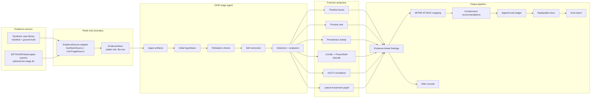

# Architecture Diagram

This project uses a read-only evidence pipeline with architectural guardrails,
not just prompt instructions. The default build runs offline on synthetic
evidence. The live path can point at SIFT/KAPE/Velociraptor-style exports
without changing the agent, detectors, ledger, or eval harness.

## Security Boundaries

- Original evidence is opened through read-only adapters. The agent never writes
  back into evidence directories.
- Every conclusion must carry one or more `evidence_refs`, such as
  `sysmon.evtx.jsonl:9`, so a reviewer can trace claims to raw rows.
- The default project does not require an MCP server. If an MCP or live forensic
  tool is added later, it should sit outside the read-only boundary and return
  copied/exported evidence rows, not mutable host access.
- Prompt guardrails are not relied on for evidence integrity. The architectural
  guardrail is the adapter/store split plus append-only outputs.

## Pattern

Autonomous single-agent investigation loop:

`ingest -> hypothesis -> refute -> self-correct -> analyze -> cite evidence -> score`

The loop is visible in `out/trace.json`; the final findings are in
`out/ledger.json`; aggregate accuracy is in `eval/report.json`.
